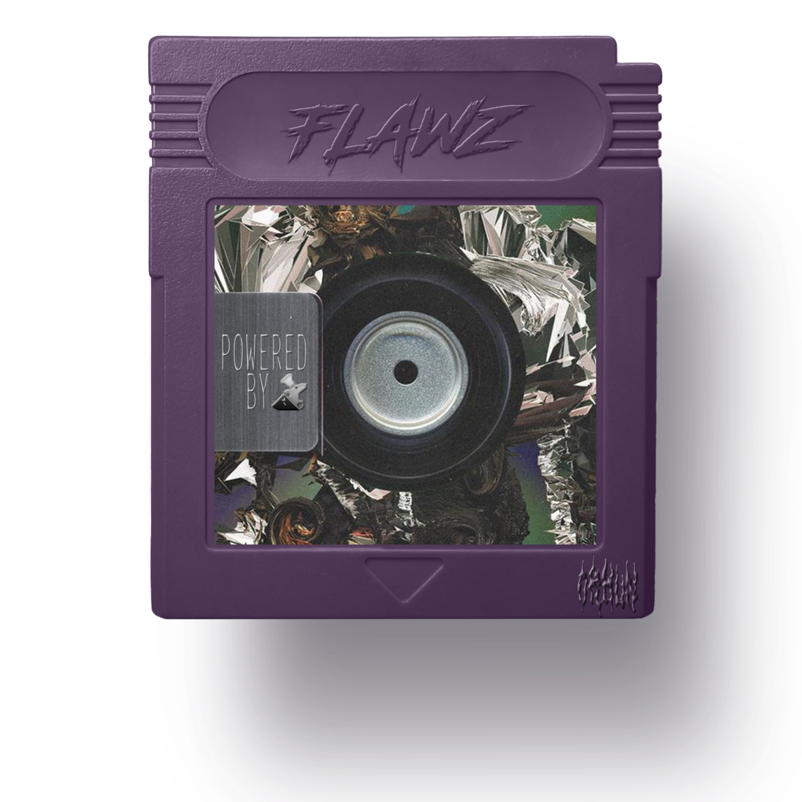
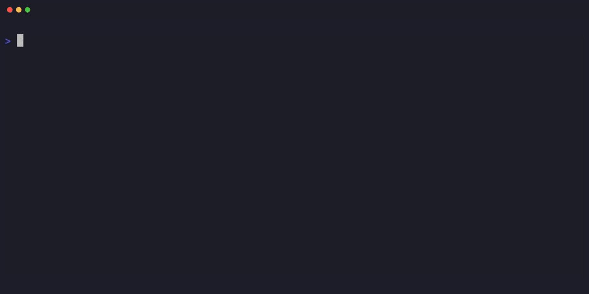
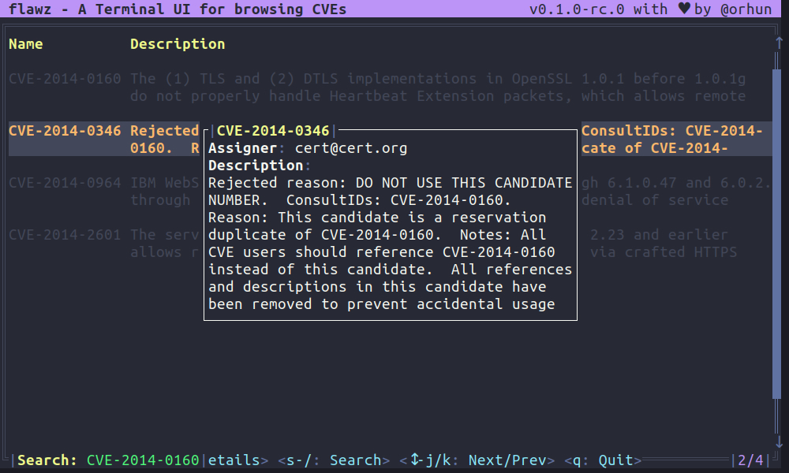
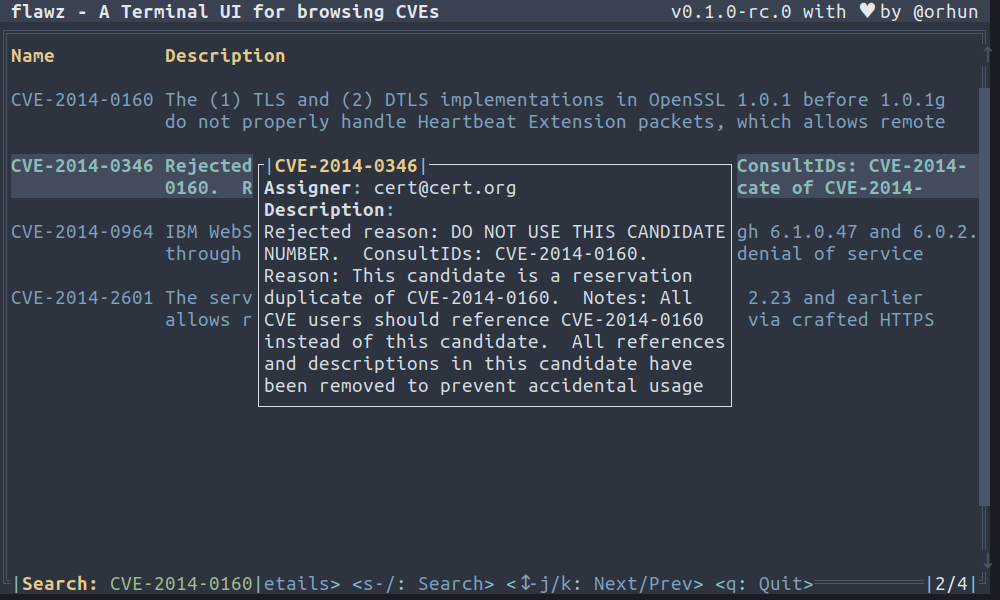
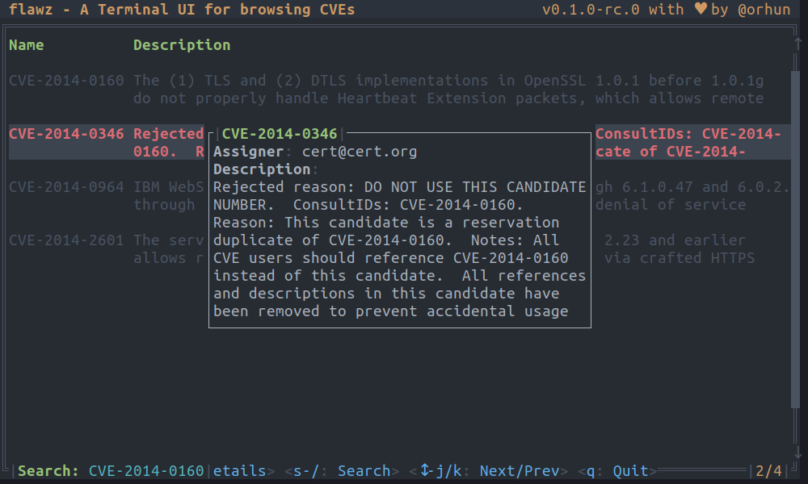
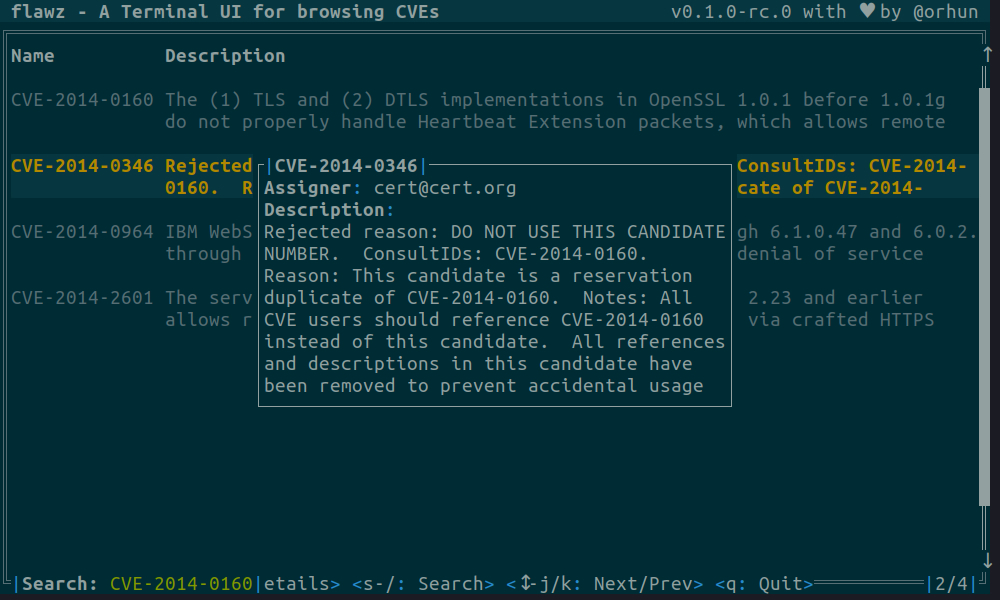

<div align="center">

<a href="https://github.com/orhun/flawz">
  
</a>

<a href="https://github.com/orhun/flawz/releases"></a>
<a href="https://crates.io/crates/flawz/"></a>
<a href="https://github.com/orhun/flawz/actions?query=workflow%3A%22Continuous+Integration%22"></a>
<a href="https://github.com/orhun/flawz/actions?query=workflow%3A%22Release%22"></a>
<a href="https://docs.rs/flawz/"></a>

---

**flawz** is a Terminal User Interface (TUI) for browsing the security vulnerabilities (also known as [CVEs](https://en.wikipedia.org/wiki/Common_Vulnerabilities_and_Exposures)).

</div>

As default it uses the vulnerability database ([NVD](https://nvd.nist.gov)) from [NIST](https://www.nist.gov) and provides search and listing functionalities in the terminal with different theming options.

For example, to view details on the notorious [xz vulnerability](https://nvd.nist.gov/vuln/detail/CVE-2024-3094):

```sh
flawz --feeds 2024 --query xz
```



<details>
  <summary>Table of Contents</summary>

<!-- vim-markdown-toc GFM -->

- [Installation](#installation)
  - [Cargo](#cargo)
  - [Arch Linux](#arch-linux)
  - [Alpine Linux](#alpine-linux)
  - [NetBSD](#netbsd)
  - [Binary releases](#binary-releases)
  - [Build from source](#build-from-source)
- [Usage](#usage)
- [Examples](#examples)
- [Themes](#themes)
  - [Dracula (default)](#dracula-default)
  - [Nord](#nord)
  - [One Dark](#one-dark)
  - [Solarized Dark](#solarized-dark)
- [Support](#support)
- [Contributing](#contributing)
- [License](#license)
- [Copyright](#copyright)

<!-- vim-markdown-toc -->

</details>

## Installation

<details>
  <summary>Packaging status</summary>

[](https://repology.org/project/flawz/versions)

</details>

### Cargo

**flawz** can be installed from [crates.io](https://crates.io/crates/flawz) using [`cargo`](https://doc.rust-lang.org/cargo/) if [Rust](https://www.rust-lang.org/tools/install) is installed.

```sh
cargo install flawz
```

The minimum supported Rust version (MSRV) is `1.74.1`.

### Arch Linux

**flawz** can be installed from the [official repositories](https://archlinux.org/packages/extra/x86_64/flawz/) using [`pacman`](https://wiki.archlinux.org/title/Pacman):

```sh
pacman -S flawz
```

### Alpine Linux

**flawz** is available for [Alpine Edge](https://pkgs.alpinelinux.org/packages?name=flawz&branch=edge). It can be installed via [`apk`](https://wiki.alpinelinux.org/wiki/Alpine_Package_Keeper) after enabling the [testing repository](https://wiki.alpinelinux.org/wiki/Repositories).

```sh
apk add flawz
```

### NetBSD

**flawz** is available from the [official repositories](https://pkgsrc.se/security/flawz). To install it, simply run:

```sh
pkgin install flawz
```

### Binary releases

See the available binaries for different targets from the [releases page](https://github.com/orhun/flawz/releases).

### Build from source

1. Clone the repository.

```sh
git clone https://github.com/orhun/flawz && cd flawz/
```

2. Build.

```sh
CARGO_TARGET_DIR=target cargo build --release
```

Binary will be located at `target/release/flawz`.

## Usage

```sh
flawz [OPTIONS]
```

**Options**:

```sh
  --url <URL>           A URL where NIST CVE 1.1 feeds can be found [env: URL=] [default:
                        https://nvd.nist.gov/feeds/json/cve/1.1/]
-f, --feeds [<FEEDS>...]  List of feeds that are going to be synced [env: FEEDS=] [default: 2002:2024 recent
                        modified]
-d, --db <DB>             Path to the SQLite database used to store the synced CVE data [env: DB=]
-u, --force-update        Always fetch feeds
-o, --offline             Do not fetch feeds
-q, --query <QUERY>       Start with a search query [env: QUERY=]
-t, --theme <THEME>       Set the theme [default: dracula] [possible values: dracula, nord, one-dark,
                        solarized-dark]
-h, --help                Print help (see more with '--help')
-V, --version             Print version
```

## Examples

To start with a specific search query:

```sh
flawz --query "buffer overflow"
```

You can use the `--feeds` option to sync specific years of feeds:

```sh
flawz --feeds 2010:2015 recent
```

Additionally, you can use the following flags:

- `--force-update`: Always fetch feeds, even if they are already up to date.
- `--offline`: Run without fetching feeds (useful if you have already synced the data):

For example, you can use the following command to search for a specific vulnerability from 2014:

```sh
flawz -q "CVE-2014-0160" -f 2014 --force-update
```

## Themes

Start `flawz` with `--theme` option to set a custom theme, e.g. `--theme nord`.

### Dracula (default)



### Nord



### One Dark



### Solarized Dark



## Support

[](https://github.com/sponsors/orhun)

If you find **flawz** and/or other projects [on my GitHub](https://github.com/orhun) useful, consider supporting me on [GitHub Sponsors](https://github.com/sponsors/orhun)! 💖

## Contributing

See our [Contribution Guide](./CONTRIBUTING.md) and please follow the [Code of Conduct](./CODE_OF_CONDUCT.md) in all your interactions with the project.

## License

[](./LICENSE-MIT)
[](./LICENSE-APACHE)

Licensed under either of [Apache License Version 2.0](./LICENSE-APACHE) or [The MIT License](./LICENSE-MIT) at your option.

🦀 ノ( º \_ º ノ) - respect crables!

## Copyright

Copyright © 2024, [Orhun Parmaksız](mailto:orhunparmaksiz@gmail.com)
